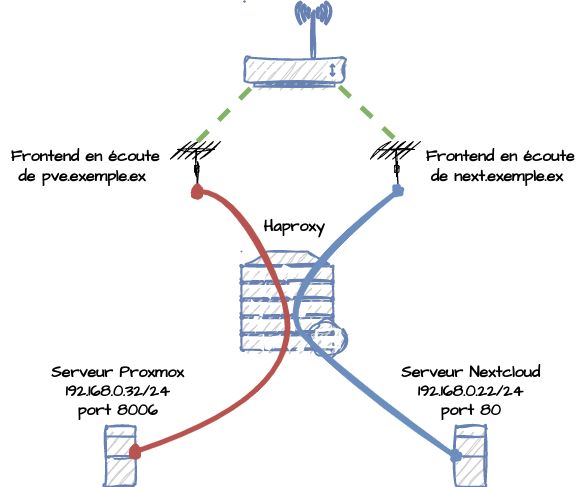

# Certificats Let’s Encrypt Wildcard avec Certbot en utilisant un challenge DNS-01 automatique pour un serveur Haproxy

## Contexte
Le but est de créer des certificats wildcard valables pour tous les sous-domaines d'un domaine donné, de manière automatique, pas besoin de créer un nouveau certificat pour chaque nouveau sous-domaine.

Création d'un certificat wildcard pour un domaine donné dans le but d'avoir plusieurs sous domaines certifiés.

Renouvellement automatique des certificats en utilisant un challenge DNS-01, la modification automatique des zones DNS se fait à l'aide du plugin certbot-dns-online.

Exemple avec le domaine exemple.ex.



J’utilise Online.net nouvellement appelé Scaleway pour acquérir un nom de domaine et configurer mes zones DNS, je parle ici de l'ajout des alias concernant mes sous domaines, exemple : web.exemple.ex, next.exemple.ex...

J'utilise mon serveur Haproxy en tant que reverse proxy, mes sous domaines servent de point d'entrée, par la suite HAproxy redirige le flux vers une machine locale.

Je n'aborde pas ici la configuration des zones DNS n'y l'installation et la configuration de HAproxy.

## Les besoins
* Achetez un nom de domaine auprès de <https://console.online.net/fr/login>.
* Un ordinateur avec Ubuntu/Debian avec HAproxy.
* Le token d'authentification à l'API d'Online.net.

## Le plugin utilisé pour le challenge DNS-01 sur online.net
Le plugin certbot-dns-online permet à Certbot de se connecter à l'API d'online.net dans le but de modifier les zones DNS, c'est de cette manière qu'on pourra utiliser le challenge DNS-01 pour avoir un renouvellement des certificats automatiquement.

**certbot-dns-online** est un plugin fourni par d'autres développeurs que ceux du projet Certbot,
c'est une version expérimentale, mais déjà largement utilisée.

Liens du plugin : <https://pypi.org/project/certbot-dns-online/>

## Étape par étape
J'ai créé un tutoriel et aussi un script pour automatiser le tout.
Vous pouvez soit utiliser le tutoriel, soit le script.

**Utilisation du tutoriel :**
1. Ouvrir le fichier tuto_install.md et suivre les étapes.

**Utilisation du script :**
1. Aller sur la page <https://console.online.net/fr/api/access> pour récupérer le token permettant de s'authentifier auprès de l'API d'online.net.
2. Lancer le script install_certs.sh
```bash
./install_certs.sh
```
3. Saisir les informations demandées.

## Description des fichiers
|Fichier|Description|
|:---:|:---:|
|tuto_install.md|Tutoriel.|
|install_certs.sh|Script de création de certificats.|
|script_after_renew.sh|Script d'automatisation du renouvellement des certificats.|
